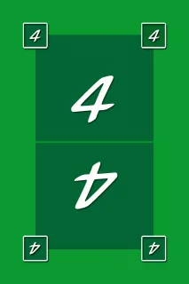

# WIZARD [](https://coveralls.io/github/Jakob63/WizardSE?branch=master) [](https://github.com/Jakob63/WizardSE/actions/workflows/scala.yml)

---

## Spielregeln

Ziel des Spiels ist es, die Anzahl der eigenen Stiche pro Runde korrekt vorherzusagen.

1.  **Ansage:** Zu Beginn jeder Runde gibt jeder Spieler einen Tipp ab, wie viele Stiche er erzielen wird.
2.  **Spielablauf:**
    - Es herrscht Bedienpflicht (Farbe bekennen).
    - **Zauberer:** Höchste Karte, gewinnt den Stich (der erste gespielte Zauberer gewinnt).
    - **Narr:** Niedrigste Karte, gewinnt den Stich nur, wenn ausschließlich Narren liegen.
    - **Trumpf:** Wenn eine Farbe nicht bedient werden kann, kann mit Trumpf gestochen werden.


   

*Beispiele für Spielkarten: Wizard, Narr und eine grüne 4*

3.  **Punktesystem:**
    - Vorhersage korrekt: 20 Punkte Basis + 10 Punkte pro Stich.
    - Vorhersage falsch: -10 Punkte pro Stich Differenz (egal ob zu viel oder zu wenig).

---

## Setup & Start

### Voraussetzungen
- SBT
- Java JDK 11 oder neuer

### Anwendung starten

Normalerweise startet man das Spiel einfach über die `Wizard.scala` (rechtsklick -> run).
Alternativ geht's auch per Terminal (dauert lange und war bei uns laggy):
```bash
sbt run
```

### Tests ausführen
Die Badge anschauen *oder* in die Pipeline schauen *oder* per Terminal (dauert lange):

```bash
sbt test
```

---

## Abgaben

- [Project Setup](/readmes/project_setup.md)
- [Git & GitHub](readmes/git_github.md)
- [Testing & Coverage](readmes/coverage.md)
- [TUI](readmes/TUI.md)
- [MVC Architektur](readmes/MVC.md)
- [GitHub Actions & Coveralls](readmes/actions_coveralls.md)
- [Design Patterns](readmes/pattern.md)
- [Undo / Redo](readmes/undo.md)
- [GUI (ScalaFX)](readmes/GUI.md)
- [Komponenten & Interfaces](readmes/components.md)
- [Dependency Injection](readmes/DI.md)
- [File IO (JSON/XML)](readmes/fileIO.md)
- [Docker](readmes/docker.md)
